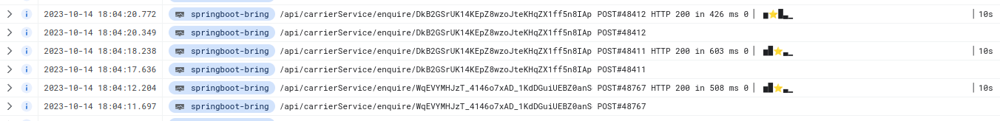

 
[](https://mvnrepository.com/artifact/com.github.skjolber.histogram/inline)


# inline-histogram
Simple utility for visualizing a histogram in a single line of text, using [box-drawing-characters](https://en.wikipedia.org/wiki/Box-drawing_character). 

Features: 

 * generate normalized text histograms:
    * Vanilla:
        * ▁▂▃▅▆▇
    * Labels:
       * 0s▕ ▁▂▃▃▅▆▇ ▏5s
    * Indicator:
       *  ▁▂▃▅⭐▆▇

The library is primarily intended for simple visualization of HTTP request durations in logs.

## License
[Apache 2.0]

## Obtain
The project is built with [Maven] and is available on the central Maven repository. 

<details>
  <summary>Maven coordinates</summary>

Add the property
```xml
<inline-histogram.version>1.0.0</inline-histogram.version>
```

then add

```xml
<dependency>
    <groupId>com.github.skjolber.histogram</groupId>
    <artifactId>inline</artifactId>
    <version>${inline-histogram.version}</version>
</dependency>
```
</details>

or

<details>
  <summary>Gradle coordinates</summary>

For

```groovy
ext {
  inlineHistogramVersion = '1.0.0'
}
```

add

```groovy
api ("com.github.skjolber.histogram:inline:${inlineHistogramVersion}")
```
</details>

# Usage
So we want to create a `HistogramCharSequence`. The `DefaultHistogram` implementation is a fixed size histogram with thread-safe counters.

```
DefaultHistogram histogram = DefaultHistogram.newBuilder()
	.add(0, "0s")
	.add(250)
	.add(500)
	.add(750)
	.add(1000, "1000s")
	.build();
```

then update by index

```
histogram.incrementByIndex(1);
```

or value

```
histogram.incrementByValue(444);
```

when it is time to see the results, get the `HistogramCharSequence` and print it.

```
HistogramCharSequence sequence = HistogramCharSequenceFactory.newInstance(histogram);

LOGGER.info("https://... HTTP 200 in 444ms " + sequence);
```

Note that resolution is limited to 9 levels.

# Supported tools
Support depends on the font used in the log accumulation tool. This implementation has been tested with

 * GCP's Stackdriver

Example:

 * 0 to 10 second histogram, with
 * 250 ms slots, and
 * labels, with
 * indicator (⭐) for the current request
 


[Apache 2.0]:          	http://www.apache.org/licenses/LICENSE-2.0.html
[issue-tracker]:       	https://github.com/skjolber/inline-histogram/issues
[Maven]:                http://maven.apache.org/
